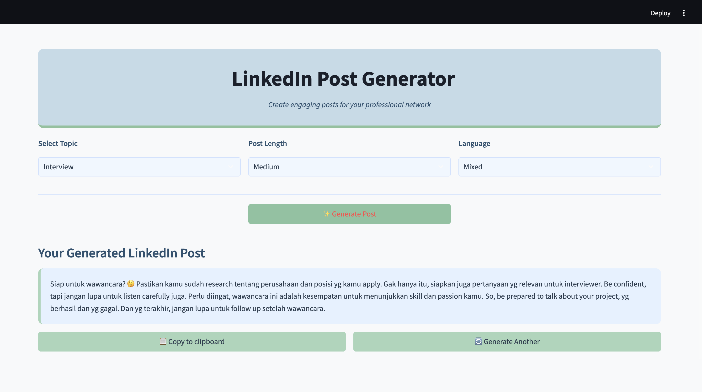

# LinkedIn Post Generator

This tool uses AI and Large Language Models (LLMs) like LLaMA and Groq to scrape LinkedIn posts and create new, engaging content. It learns from successful posts using few-shot learning and generates posts that match their style. With natural language processing (NLP), it understands the text and context, making the content relevant and personalized in multiple languages. Powered by LLaMA3 and Groq, it creates human-like posts for your LinkedIn needs.


## Overview

This project consists of two main components:
1. **LinkedIn Scraper**: Collects posts from LinkedIn profiles
2. **Post Generator**: Analyzes existing posts and generates new ones using LLM (Groq/Llama3)

The system uses few-shot learning techniques to understand what makes LinkedIn posts engaging, and generates new content following similar patterns.

## Features

- **LinkedIn Post Scraping**:
  - Automated login and data collection
  - Extraction of post text, engagement metrics (likes, comments, shares)
  - Profile activity analysis
  - Data export in multiple formats (JSON)

- **Post Analysis**:
  - Automatic language detection (English, Indonesian, Mixed)
  - Content tagging and categorization
  - Length analysis (Short, Medium, Long)
  - Engagement metrics processing

- **AI-Powered Post Generation**:
  - Topic-based content creation
  - Multi-language support (English, Indonesian, Mixed)
  - Configurable length and style
  - Example-based learning from successful posts

## Project Structure

```
linkedin-post-generator/
├── data/
│   ├── processed_posts.json  # Enriched post data with metadata
│   └── raw_posts.json        # Raw scraped posts
├── linkedin-scraper/
│   ├── credentials.py        # LinkedIn login credentials (not included in repo)
│   ├── linkedin-scraper.py   # Scraping logic
│   └── [output files]        # Generated during scraping
├── .env                      # Environment variables for API keys
├── few_shot.py               # Few-shot learning implementation
├── llm_helper.py             # LLM integration utilities
├── main.py                   # Application entry point
├── post_generator.py         # Post generation logic
├── preprocess.py             # Data preprocessing utilities
└── requirements.txt          # Python dependencies
```

## Installation

1. Clone the repository:
   ```
   git clone https://github.com/caernations/linkedin-post-generator
   cd linkedin-post-generator
   ```

2. Install dependencies:
   ```
   pip install -r requirements.txt
   ```

3. Create a `.env` file with your API key:
   ```
   GROQ_API_KEY=your_groq_api_key_here
   ```

4. For LinkedIn scraping, create a `credentials.py` file in the `linkedin-scraper` directory:
   ```python
   username = "your_linkedin_email"
   password = "your_linkedin_password"
   ```

## Usage

### Scraping LinkedIn Posts

1. Update the profile URL in `linkedin-scraper.py`:
   ```python
   profile_url = 'https://www.linkedin.com/in/target_profile/'
   ```

2. Run the scraper:
   ```
   python linkedin-scraper/linkedin-scraper.py
   ```

3. The scraper will:
   - Login to LinkedIn using your credentials
   - Navigate to the specified profile
   - Scroll through their activity to load posts
   - Extract and save post data to JSON files

### Processing Raw Posts

To enrich raw posts with metadata:

```
python preprocess.py
```

This will:
- Extract language, line count and tags from each post
- Unify and categorize tags
- Save the processed data to `data/processed_posts.json`

### Generating New Posts

To generate a LinkedIn post:

```python
from post_generator import generate_post

# Parameters:
# - Length: "Short" (1-5 lines), "Medium" (6-10 lines), "Long" (11-15 lines)
# - Language: "English", "Indonesia", "Mixed"
# - Tag: Topic category like "Personal", "Technology", etc.

post = generate_post("Medium", "Mixed", "Software Engineering")
print(post)
```

## Running the Application

Start the main application:

```
streamlit run main.py
```

## Requirements

To run this project, ensure you have **Python 3.8+** installed and the following Python packages:

- `selenium` – for web automation and scraping  
- `beautifulsoup4` – for parsing HTML content  
- `pandas` – for data manipulation and analysis  
- `python-dateutil` – for flexible date parsing  
- `langchain==0.2.14` – for building with LLMs  
- `langchain-core==0.2.39` – core components for LangChain  
- `langchain-community==0.2.12` – community-contributed LangChain modules  
- `langchain-groq==0.1.9` – integration with Groq LLMs  
- `streamlit==1.35.0` – for building interactive frontends  
- `python-dotenv` – to manage environment variables  

## Notes

- The LinkedIn scraper requires a valid LinkedIn account
- Excessive scraping may lead to LinkedIn rate limiting or account restrictions
- For better post generation, collect at least 50-100 posts as examples
- The quality of generated posts depends on the quality and quantity of scraped examples


## Acknowledgements

- This project uses Llama3-70B via the Groq API